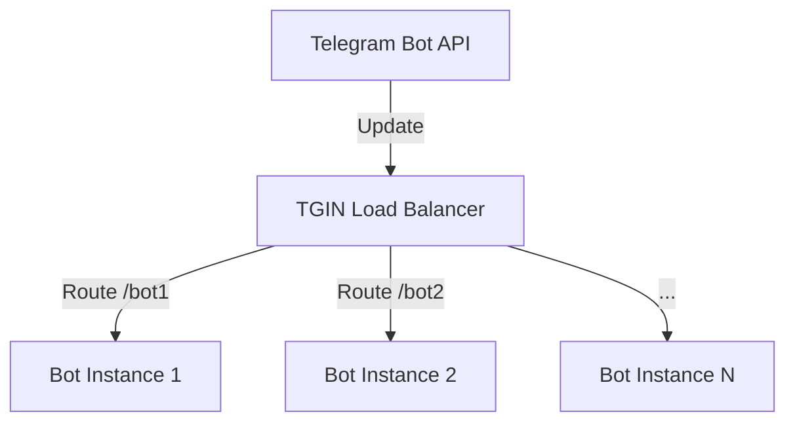
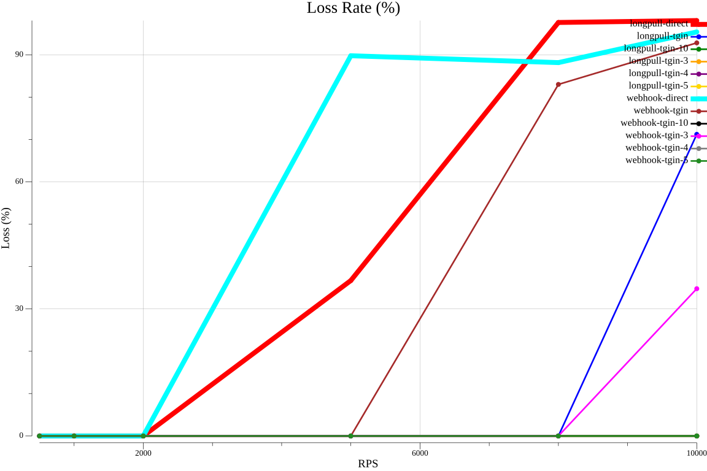
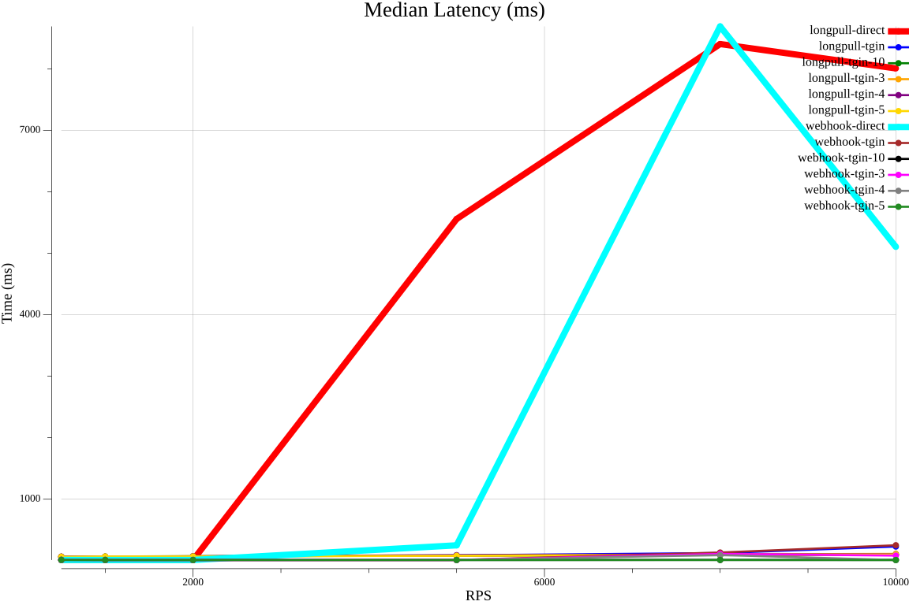
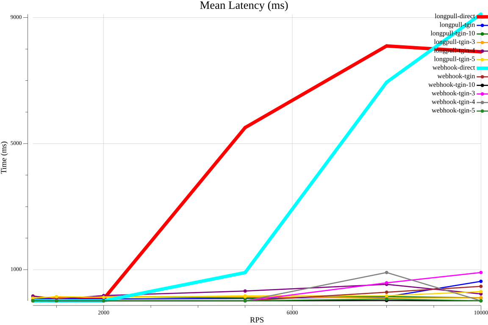
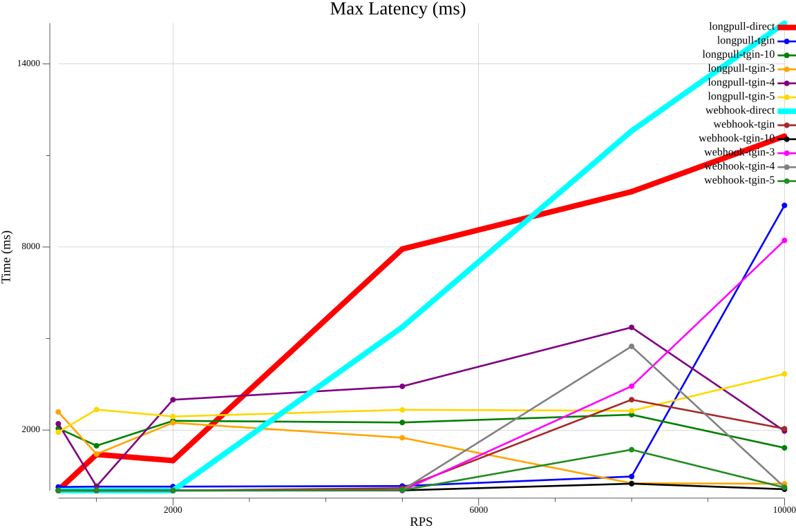

```
 __                          
/\ \__         __            
\ \ ,_\    __ /\_\    ___    
 \ \ \/  /'_ `\/\ \ /' _ `\  
  \ \ \_/\ \L\ \ \ \/\ \/\ \ 
   \ \__\ \____ \ \_\ \_\ \_\
    \/__/\/___L\ \/_/\/_/\/_/
           /\____/           
           \_/__/
```

<p align="center"><strong>TGIN</strong> <em>- dedicated infrastructure layer for highly loaded Telegram bots.</em></p>

<p align="center">
          
        <a></a>

</p>

<p>
TGIN solves the problem of distributing incoming updates between multiple bots. Created for those who scale Telegram bots. Imagine NGINX for the Telegram Bot API ecosystem
</p>

<hr>


[DOCUMENTATION](DOCS.md) | [PERFORMANCE](PERF.md)

### Why Tgin?
- Load balancing: distributes Telegram updates evenly across multiple bot instances

- Protocol flexibility: Supports both webhook and longpoll methods for receiving and sending updates

- Framework integration: works with any Telegram bot framework 

- Scalability: enables horizontal scaling by adding more bot instances without code changes

- Zero-downtime deployments: update or restart bot instances without interrupting service

- Microservices support: route updates to specialized bot services in a distributed architecture

- Production reliability: includes health monitoring, automatic retries, and failover handling

### Architecture Overview



### Quick start
To launch the project, we will need the `1.91.1` version of Rust


#### 1. Clone and build the project:

```Bash
git clone https://github.com/chesnokpeter/tgin.git
cd tgin
cargo build --release
```
#### 2. Change config file `tgin.ron`:

```ron
(
    server_port: Some(3000),
    updates: [
        LongPollUpdate(
            token: "YOUR_BOT_TOKEN", // Replace with your actual bot token from @BotFather
        )
    ],
    route: RoundRobinLB(
        routes: [
            LongPollRoute(path: "/test-bot/getUpdates"),
        ]
    )
)
```

#### 3. Start with config

```Bash
./target/release/tgin -f tgin.ron
```


### Future features
- Complete API
- More tests / Performance tests
- Perfect logging
- Anti-DDoS guard
- Message-brokers support 
- Microservices-style
- Collect analytics
- Cache for bot
- Support userbots


### Main Goal
**Provide a complete infrastructure toolkit for building scalable, high-load Telegram bots with microservices architecture and production-ready support**

### Profit

<table>
  <tr>
    <td></td>
    <td></td>
  </tr>
  <tr>
    <td></td>
    <td></td>
  </tr>
</table>